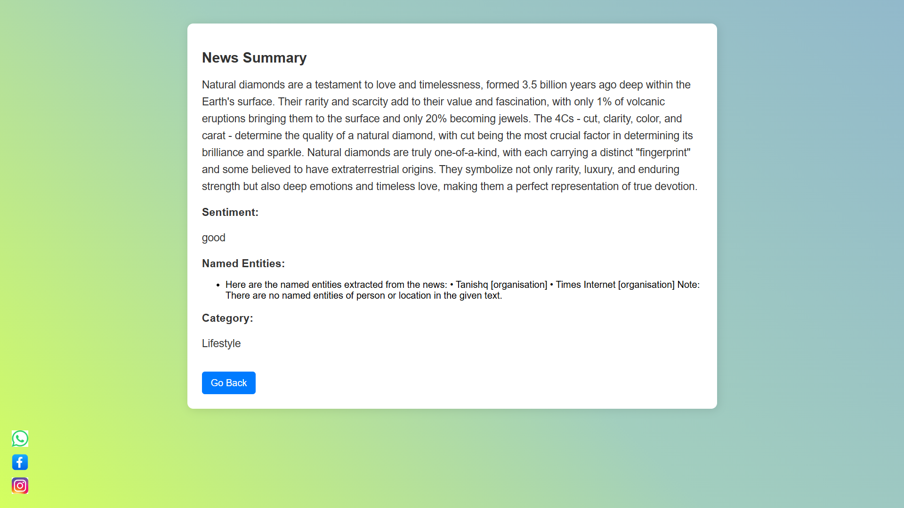
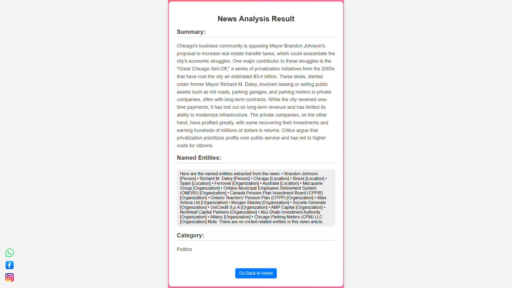

 **📌 Table of Contents**  
- [Introduction](#introduction)  
- [Features](#features)  
- [Tech Stack](#tech-stack)  
- [Installation Guide](#installation-guide)  
- [Usage](#usage)  
- [Project Structure](#project-structure)    
- [Database Schema](#database-schema)  
- [Screenshots](#screenshots)  
  

---

**📖 Introduction**  
This project is a **News Summarization & Analysis Web App** that allows users to:  
✅ Fetch news using a **URL** (via web scraping)  
✅ Summarize news content using **LangChain (LLaMA 3.1 Model)**  
✅ Perform **Named Entity Recognition (NER)** to extract important entities  
✅ Categorize news into different **topics** (Politics, Technology, Sports, etc.)  
✅ Store news history in an **SQLite Database**  
✅ Share news summaries on **WhatsApp & Facebook**  

---

## **🚀 Features**  
✔ **News Fetching:** Scrapes news articles from any URL  
✔ **Summarization:** Uses **LangChain + LLaMA 3.1** for short summaries  
✔ **NER (Named Entity Recognition):** Extracts key names, places, dates  
✔ **Category Classification:** Classifies news into relevant topics  
✔ **News History:** Stores searched news in a **MongoDB Database**  
✔ **User Interface:** Interactive & responsive web app using **Flask + HTML + CSS**  
✔ **Social Media Sharing:** Share news on **WhatsApp & Facebook**  

---

## **🛠 Tech Stack**  
| Category       | Technology Used |
|---------------|----------------|
| **Backend**   | Flask (Python) |
| **Frontend**  | HTML, CSS, Jinja2 |
| **AI Models** | LangChain (LLaMA 3.1) |
| **Database**  | SQLite |
| **Web Scraping** | Newspaper3k |
| **Deployment** | GitHub, Flask |

---

## **📥 Installation Guide**  

### **🔹 1️⃣ Clone the Repository**  
```bash
git clone https://github.com/your-username/news-analysis.git
cd news-analysis
```

### **🔹 2️⃣ Create a Virtual Environment (Optional but Recommended)**  
```bash
python -m venv venv
source venv/bin/activate  # For Mac/Linux
venv\Scripts\activate     # For Windows
```

### **🔹 3️⃣ Install Dependencies**  
```bash
pip install -r requirements.txt
```

### **🔹 4️⃣ Set Up the Database**  
```bash
python database.py  # Creates SQLite database
```

### **🔹 5️⃣ Run the Flask App**  
```bash
python app.py
```

### **🔹 6️⃣ Open the App in Browser**  
Visit: **`http://127.0.0.1:5000/`**  

---

## **📌 Usage**  
1. Enter a **news URL** in the search box  
2. Click **"Fetch & Summarize"**  
3. View the **summary, named entities, and category**  
4. Share the summarized news on **WhatsApp & Facebook**  
5. View previously fetched news in the **history section**  

---

## **📂 Project Structure**  
```
news-analysis/
│-- static/
│   │-- styles.css
│   │-- whatsapp.png
│   │-- facebook.png
│-- templates/
│   │-- index.html
│   │-- text_analysis.html
│-- database.py
│-- app.py
│-- requirements.txt
│-- README.md
```

- **static/** → CSS & images  
- **templates/** → HTML files  
- **database.py** → SQLite database management  
- **app.py** → Main Flask app logic  

---


## **📊 Database Schema**  
```sql
CREATE TABLE news_history (
    id INTEGER PRIMARY KEY AUTOINCREMENT,
    url TEXT NOT NULL,
    summary TEXT NOT NULL,
    entities TEXT,
    category TEXT,
    timestamp DATETIME DEFAULT CURRENT_TIMESTAMP
);
```

---

**📸 Screenshots: **  


🔹 **Home Page**  
  

🔹 **Summarized News**  
  

🔹 **Analysed News**



